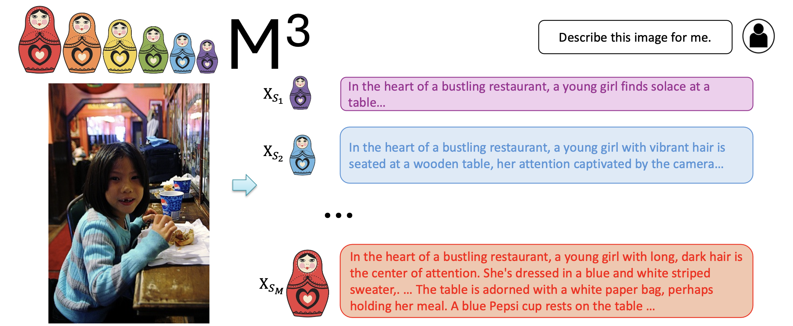
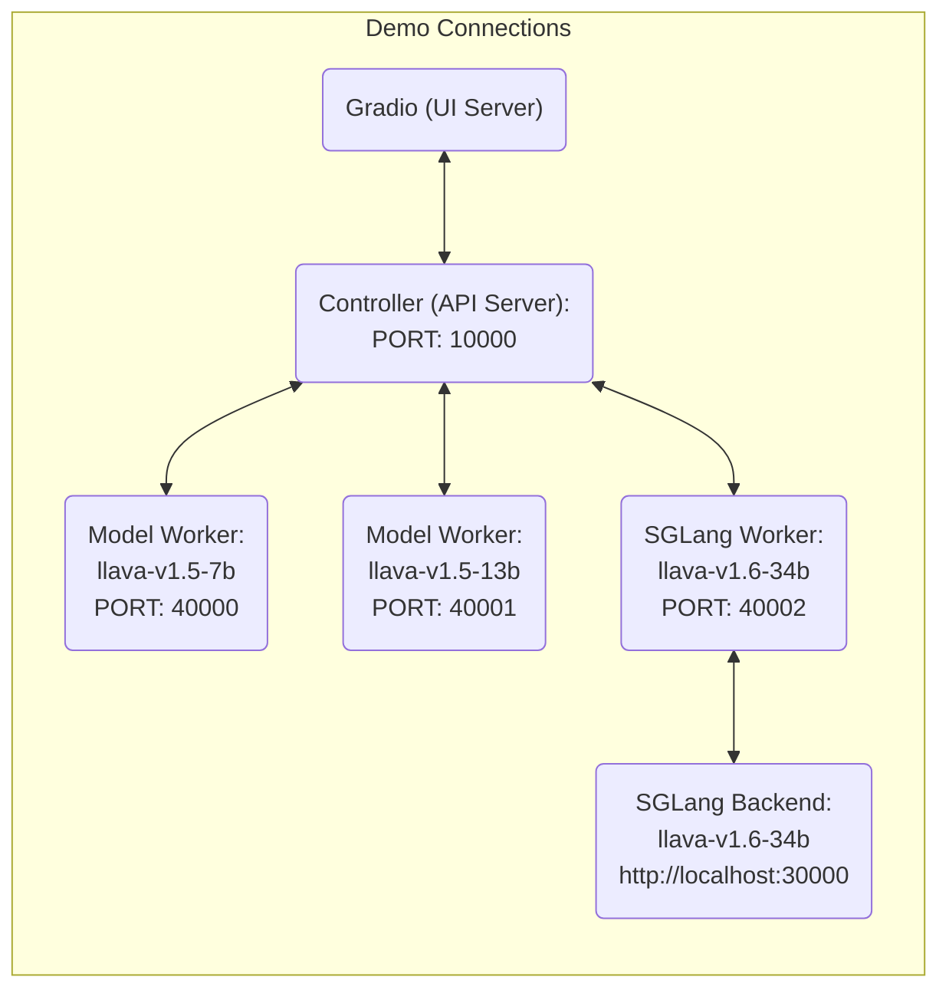

# 🌋 M3: Matryoshka Multimodal Models

*Learning multi-granularities visual tokens a coarse-to-fine nested way*
<br>
[Mu Cai](https://pages.cs.wisc.edu/~mucai/), [Jianwei Yang](https://jwyang.github.io/), [Jianfeng Gao](https://www.microsoft.com/en-us/research/people/jfgao/?from=http%3A%2F%2Fresearch.microsoft.com%2Fen-us%2Fum%2Fpeople%2Fjfgao%2F) , [Yong Jae Lee](https://pages.cs.wisc.edu/~yongjaelee/)


[[Paper](https://arxiv.org/abs/2405.17430)] [[Project Page](https://matryoshka-mm.github.io/)] [[Demo](https://pages.cs.wisc.edu/~mucai/matryoshka-mm.html)]  [[Model Zoo](https://github.com/mu-cai/matryoshka-mmb/lob/main/docs/MODEL_ZOO.md)]


<!--p align="center">
    <a href="https://llava.hliu.cc/"></a> <br>
    Generated by <a href="https://gligen.github.io/">GLIGEN</a> via "a cute lava llama with glasses" and box prompt
</p-->




## Release

- [5/27] 🔥 We released **Matryoshka Multimodal Models**. We propose to learn visual tokens in a nested manner following a coarse-to-fine order.  Checkout the [paper](https://arxiv.org/abs/xx) and [demo](https://pages.cs.wisc.edu/~mucai/matryoshka-mm.html).


<!-- <details>
<summary>More</summary>
</details> -->

<!-- <a href="https://llava.hliu.cc/"></a> -->

[](https://github.com/tatsu-lab/stanford_alpaca/blob/main/LICENSE)
**Usage and License Notices**: This project utilizes certain datasets and checkpoints that are subject to their respective original licenses. Users must comply with all terms and conditions of these original licenses, including but not limited to the [OpenAI Terms of Use](https://openai.com/policies/terms-of-use) for the dataset and the specific licenses for base language models for checkpoints trained using the dataset (e.g. [Llama community license](https://ai.meta.com/llama/license/) for LLaMA-2 and Vicuna-v1.5). This project does not impose any additional constraints beyond those stipulated in the original licenses. Furthermore, users are reminded to ensure that their use of the dataset and checkpoints is in compliance with all applicable laws and regulations.


## Contents
- [Install](#install)
- [LLaVA Weights](#llava-weights)
- [Demo](#Demo)
- [Model Zoo](https://github.com/mu-cai/matryoshka-mm/blob/main/docs/MODEL_ZOO.md)
- [Dataset](https://github.com/mu-cai/matryoshka-mm/blob/main/docs/Data.md)
- [Train](#train)
- [Evaluation](#evaluation)

## Install

If you are not using Linux, do *NOT* proceed, see instructions for [macOS](https://github.com/mu-cai/matryoshka-mm/blob/main/docs/macOS.md) and [Windows](https://github.com/mu-cai/matryoshka-mm/blob/main/docs/Windows.md).

1. Clone this repository and navigate to LLaVA folder
```bash
git clone https://github.com/mu-cai/matryoshka-mm.git
cd LLaVA
```

2. Install Package
```Shell
conda create -n matryoshka-mm python=3.10 -y
conda activate matryoshka-mm
pip install --upgrade pip  # enable PEP 660 support
pip install -e .
```

3. Install additional packages for training cases
```
pip install -e ".[train]"
pip install flash-attn --no-build-isolation
```

### Quick Start With HuggingFace

<details>
<summary>Example Code</summary>

```Python
from llava.model.builder import load_pretrained_model
from llava.mm_utils import get_model_name_from_path
from llava.eval.run_llava import eval_model

model_path = "mucai/llava-next-vicuna-7b-m3"

tokenizer, model, image_processor, context_len = load_pretrained_model(
    model_path=model_path,
    model_base=None,
    model_name=get_model_name_from_path(model_path)
)
```

Check out the details wth the `load_pretrained_model` function in `llava/model/builder.py`.

You can also use the `eval_model` function in `llava/eval/run_llava.py` to get the output easily. By doing so, you can use this code on Colab directly after downloading this repository.

``` python
model_path = "mucai/llava-next-vicuna-7b-m3"
prompt = "What are the things I should be cautious about when I visit here?"
image_file = "https://llava-vl.github.io/static/images/view.jpg"

args = type('Args', (), {
    "model_path": model_path,
    "model_base": None,
    "model_name": get_model_name_from_path(model_path),
    "query": prompt,
    "conv_mode": None,
    "image_file": image_file,
    "sep": ",",
    "temperature": 0,
    "top_p": None,
    "num_beams": 1,
    "max_new_tokens": 512
})()

eval_model(args)
```
</details>

## Matryoshka-mm Weights
Please check out our [Model Zoo](https://github.com/mu-cai/matryoshka-mm/blob/main/docs/MODEL_ZOO.md) for all public M3 checkpoints, and the instructions of how to use the weights.

## Demo

### Gradio Web UI

To launch a Gradio demo locally, please run the following commands one by one. If you plan to launch multiple model workers to compare between different checkpoints, you only need to launch the controller and the web server *ONCE*.



#### Launch a controller
```Shell
python -m llava.serve.controller --host 0.0.0.0 --port 30000
```

#### Launch a gradio web server.
```Shell
python -m llava.serve.gradio_web_server --controller http://localhost:30000 --model-list-mode reload
```
You just launched the Gradio web interface. Now, you can open the web interface with the URL printed on the screen. You may notice that there is no model in the model list. Do not worry, as we have not launched any model worker yet. It will be automatically updated when you launch a model worker.

#### Launch a model worker

This is the actual *worker* that performs the inference on the GPU.  Each worker is responsible for a single model specified in `--model-path`.

```Shell
python -m llava.serve.model_worker --host 0.0.0.0 --controller http://localhost:30000 --port 40000 --worker http://localhost:40000 --model-path mucai/llava-next-vicuna-7b-m3
```
Wait until the process finishes loading the model and you see "Uvicorn running on ...".  Now, refresh your Gradio web UI, and you will see the model you just launched in the model list.

You can launch as many workers as you want, and compare between different model checkpoints in the same Gradio interface. Please keep the `--controller` the same, and modify the `--port` and `--worker` to a different port number for each worker.
```Shell
python -m llava.serve.model_worker --host 0.0.0.0 --controller http://localhost:30000 --port <different from 40000, say 40001> --worker http://localhost:<change accordingly, i.e. 40001> --model-path <ckpt2>
```

If you are using an Apple device with an M1 or M2 chip, you can specify the mps device by using the `--device` flag: `--device mps`.

#### Launch a model worker (Multiple GPUs, when GPU VRAM <= 24GB)

If the VRAM of your GPU is less than 24GB (e.g., RTX 3090, RTX 4090, etc.), you may try running it with multiple GPUs. Our latest code base will automatically try to use multiple GPUs if you have more than one GPU. You can specify which GPUs to use with `CUDA_VISIBLE_DEVICES`. Below is an example of running with the first two GPUs.

```Shell
CUDA_VISIBLE_DEVICES=0,1 python -m llava.serve.model_worker --host 0.0.0.0 --controller http://localhost:30000 --port 40000 --worker http://localhost:40000 --model-path mucai/llava-next-vicuna-7b-m3
```

#### Launch a model worker (4-bit, 8-bit inference, quantized)

You can launch the model worker with quantized bits (4-bit, 8-bit), which allows you to run the inference with reduced GPU memory footprint, potentially allowing you to run on a GPU with as few as 12GB VRAM. Note that inference with quantized bits may not be as accurate as the full-precision model. Simply append `--load-4bit` or `--load-8bit` to the **model worker** command that you are executing. Below is an example of running with 4-bit quantization.

```Shell
python -m llava.serve.model_worker --host 0.0.0.0 --controller http://localhost:30000 --port 40000 --worker http://localhost:40000 --model-path mucai/llava-next-vicuna-7b-m3 --load-4bit
```

#### Launch a model worker (LoRA weights, unmerged)

You can train and launch the model worker with LoRA weights using our instructions [here](https://github.com/mu-cai/matryoshka-mm/blob/main/docs/LoRA.md)..

### CLI Inference

Chat about images using LLaVA without the need of Gradio interface. It also supports multiple GPUs, 4-bit and 8-bit quantized inference. With 4-bit quantization, for our LLaVA-1.5-7B, it uses less than 8GB VRAM on a single GPU.

```Shell
python -m llava.serve.cli \
    --model-path mucai/llava-next-vicuna-7b-m3 \
    --image-file "https://llava-vl.github.io/static/images/view.jpg" \
    --load-4bit
```


## Train (with LLaVA-1.5)

M3 finetunes LLaVA checkpoints using the exact same visual instruction data. 

LLaVA is trained on 8 H100 GPUs with 80GB memory. To train on fewer GPUs, you can reduce the `per_device_train_batch_size` and increase the `gradient_accumulation_steps` accordingly. Always keep the global batch size the same: `per_device_train_batch_size` x `gradient_accumulation_steps` x `num_gpus`.

### Hyperparameters
We use the exact same hyperparameters as LLaVA in finetuning.  Hyperparameters used are provided below.

| Hyperparameter | Global Batch Size | Learning rate | Epochs | Max length | Weight decay |
| --- | ---: | ---: | ---: | ---: | ---: |
| LLaVA-v1.5-7B-M3 | 128 | 2e-5 | 1 | 2048 | 0 |

### Download Vicuna checkpoints (automatically)

Our base model Vicuna v1.5, which is an instruction-tuned chatbot, will be downloaded automatically when you run our provided training scripts. No action is needed.

### M3 Visual Instruction Tuning

1. Prepare data

Please download the annotation of the final mixture our instruction tuning data [llava_v1_5_mix665k.json](https://huggingface.co/datasets/liuhaotian/LLaVA-Instruct-150K/blob/main/llava_v1_5_mix665k.json), and download the images from constituting datasets:

- COCO: [train2017](http://images.cocodataset.org/zips/train2017.zip)
- GQA: [images](https://downloads.cs.stanford.edu/nlp/data/gqa/images.zip)
- OCR-VQA: [download script](https://drive.google.com/drive/folders/1_GYPY5UkUy7HIcR0zq3ZCFgeZN7BAfm_?usp=sharing), **we save all files as `.jpg`**
- TextVQA: [train_val_images](https://dl.fbaipublicfiles.com/textvqa/images/train_val_images.zip)
- VisualGenome: [part1](https://cs.stanford.edu/people/rak248/VG_100K_2/images.zip), [part2](https://cs.stanford.edu/people/rak248/VG_100K_2/images2.zip)

After downloading all of them, organize the data as follows in `./playground/data`,

```
├── coco
│   └── train2017
├── gqa
│   └── images
├── ocr_vqa
│   └── images
├── textvqa
│   └── train_images
└── vg
    ├── VG_100K
    └── VG_100K_2
```

2. Start training!

You may download our pretrained projectors in [Model Zoo](https://github.com/mu-cai/matryoshka-mm/blob/main/docs/MODEL_ZOO.md). It is not recommended to use legacy projectors, as they may be trained with a different version of the codebase, and if any option is off, the model will not function/train as we expected.

Training script with DeepSpeed ZeRO-3: [`finetune.sh`](https://github.com/mu-cai/matryoshka-mm/blob/main/scripts/v1_5/finetune.sh).

If you are do not have enough GPU memory:

- Use LoRA: [`finetune_lora.sh`](https://github.com/mu-cai/matryoshka-mm/blob/main/scripts/v1_5/finetune_lora.sh). We are able to fit 13B training in 8-A100-40G/8-A6000, and 7B training in 8-RTX3090. Make sure `per_device_train_batch_size*gradient_accumulation_steps` is the same as the provided script for best reproducibility.
- Replace `zero3.json` with `zero3_offload.json` which offloads some parameters to CPU RAM. This slows down the training speed.

If you are interested in finetuning M3 model to your own task/data, please check out [`Finetune_Custom_Data.md`](https://github.com/mu-cai/matryoshka-mm/blob/main/docs/Finetune_Custom_Data.md)。


## Evaluation

We use the same benchmark as LLaVA-1.5 and LLaVA-Next

For LLaVA-1.5, see [Evaluation.md](https://github.com/mu-cai/matryoshka-mm/blob/main/docs/Evaluation.md).
For LLaVA-NeXT, see [lmms-eval](https://github.com/EvolvingLMMs-Lab/lmms-eval).


## Citation

If you find LLaVA useful for your research and applications, please cite using this BibTeX:
```bibtex
@misc{cai2024matryoshka,
    author      = {Cai, Mu and Yang, Jianwei and Gao,  Jianfeng and Lee, Yong Jae},
    title       = {Matryoshka Multimodal Models},
    publisher   = {arXiv:2405.17430},
    year        = {2024}
  }
```


## Acknowledgement

- [Vicuna](https://github.com/lm-sys/FastChat): the langauge model we built upon, and our base model Vicuna-13B that has the amazing language capabilities!

- [LLaVa](https://llava-vl.github.io/): the codebase we built upon, which has amazing multimodal abalities! 


## Related Projects

- [ViP-LLaVA: Making Large Multimodal Models Understand Arbitrary Visual Prompts](https://vip-llava.github.io/)
- [CounterCurate: Enhancing Physical and Semantic Visio-Linguistic Compositional Reasoning via Counterfactual Examples](https://countercurate.github.io/)
- [LLaVA-PruMerge: Adaptive Token Reduction for Efficient Large Multimodal Models](https://llava-prumerge.github.io/)
